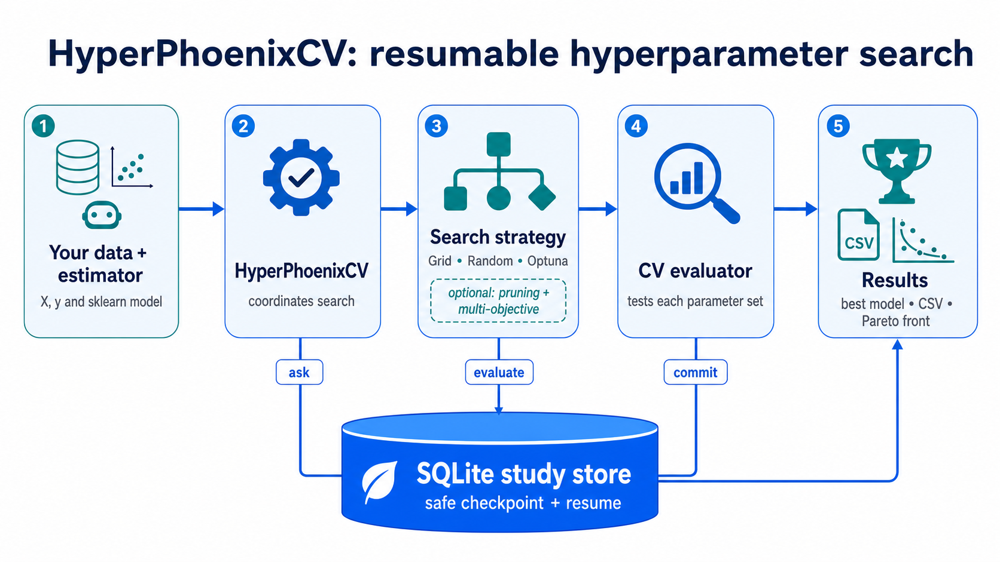

# HyperPhoenixCV 🐦‍🔥


> *"Rise from the ashes of interrupted experiments"*

HyperPhoenixCV is a smart hyperparameter tuning library that, like the mythical phoenix, **resumes after interruptions** and continues searching for optimal solutions. Never lose hours of computation due to unexpected stops again!

**Other languages:** [Русский](README_RU.md)

## ✨ Features

- **🔄 Resumable searches** – Continue from the last checkpoint after any interruption.
- **🎲 Search modes** – Exhaustive grid or reproducible random sampling.
- **🎯 Multiple search strategies** – Exhaustive grid search or random search.
- **📊 Multi‑metric evaluation** – Score using multiple metrics (F1, accuracy, precision, etc.) simultaneously.
- **💾 Transactional persistence** – Trials commit incrementally to local SQLite; CSV is an export.
- **🔌 Scikit‑learn compatible** – Seamlessly integrates with the scikit‑learn ecosystem.
- **⚡ Performance optimizations** – Parallel execution with `pre_dispatch` and graceful error handling with `error_score`.
- **⏱️ Early stopping** – Stop search early if no improvement for a given number of iterations (`early_stopping_patience`).
- **📈 Best index attribute** – Access `best_index_` for compatibility with `GridSearchCV`.

## 🚀 Installation

Install from PyPI:

```bash
pip install hyperphoenixcv
```

Or install the latest development version from source:

```bash
git clone https://github.com/valeksan/hyperphoenixcv.git
cd hyperphoenixcv
pip install -e .
```

### Supported runtime

Python 3.10–3.12 on Linux. Minimum dependencies: NumPy 1.21.6, pandas 1.5,
joblib 1.3, and scikit-learn 1.4. Optuna 3.0+ is optional. Windows and macOS
are not supported targets until durability CI coverage exists.

## 📖 Why HyperPhoenixCV?

The name **HyperPhoenixCV** refers to the mythical phoenix – a bird that rises from its ashes. In the same way, your hyperparameter search can "rise again" after an interruption, continuing from the last saved checkpoint instead of starting over from scratch.

The "CV" in the name highlights the library's focus on cross‑validation and machine‑learning workflows.


*Diagram illustrating the resumable search process.*

### How It Differs from Plain `GridSearchCV`

| Feature | `GridSearchCV` | `HyperPhoenixCV` |
|---------|----------------|------------------|
| **Resumability** | Starts over after interruption | ✅ Continues from checkpoint |
| **Optimization** | Exhaustive search only | ✅ Random or exhaustive |
| **Multi‑metric** | Single metric at a time | ✅ Multiple metrics simultaneously |
| **Persistence** | Manual saving required | ✅ Transactional SQLite + CSV export |
| **Progress tracking** | Limited | ✅ Verbose logs & intermediate results |
| **Early stopping** | Not supported | ✅ Configurable patience |
| **Error handling** | Raises exception | ✅ Configurable `error_score` (e.g., `np.nan`) |
| **Parallel dispatch** | Basic | ✅ `pre_dispatch` for better resource management |

## 🛠️ Quick Start

Here’s a minimal example that shows the core workflow:

```python
from hyperphoenixcv import HyperPhoenixCV
from sklearn.ensemble import RandomForestClassifier
from sklearn.datasets import make_classification

# Create a simple dataset
X, y = make_classification(n_samples=1000, n_features=20, random_state=42)

# Define the model and parameter grid
model = RandomForestClassifier()
param_grid = {
    'n_estimators': [50, 100, 200],
    'max_depth': [None, 10, 20],
    'min_samples_split': [2, 5, 10]
}

# Create a HyperPhoenixCV instance with checkpointing
hp = HyperPhoenixCV(
    estimator=model,
    param_grid=param_grid,
    scoring='accuracy',
    cv=5,
    checkpoint_path='my_experiment.sqlite3',
    dataset_id='training-data-v1',
    verbose=True
)

# Run the search (resumes automatically from SQLite if interrupted)
hp.fit(X, y)

print("Best parameters:", hp.best_params_)
print("Best score:", hp.best_score_)
print("Best index:", hp.best_index_)

# Get top‑5 results
top_results = hp.get_top_results(5)
print(top_results)
```

### 🔁 Resuming an Interrupted Search

If the process is stopped (e.g., due to time limits), run the same script again with the same study-store path and `dataset_id`:

```python
hp.fit(X, y)  # Automatically resumes from 'my_experiment.sqlite3'
```

SQLite is local, single-coordinator storage. It is not a shared-filesystem or multi-node backend. `resume` accepts `"auto"` (default), `"must"`, or `"never"`; a changed study identity is rejected instead of mixing results.

### Migrating a legacy pickle checkpoint

Normal `fit()` and resume never unpickle files. Import old checkpoints once into the SQLite study explicitly:

```python
report = hp.import_legacy_checkpoint("old_experiment.pkl", trusted=True)
print(report)  # imported/skipped/failed counts and invalid-record details
```

**Security warning:** pickle/joblib loading can execute arbitrary code. Set `trusted=True` only for a file whose source and contents you trust. The importer accepts legacy `List[dict]`, preserves source file, and is idempotent.

## 📚 Advanced Usage

### Deprecated surrogate ranking

`use_bayesian_optimization=True` remains temporary compatibility API only. It
does **not** implement Bayesian optimization; do not use it for adaptive search.
Use seeded random search, or genuine Optuna ask/tell:

```python
hp = HyperPhoenixCV(
    estimator=model,
    param_grid=param_grid,
    strategy="random",
    n_trials=30,
    verbose=True
)
```

Install optional backend first:

```bash
pip install "hyperphoenixcv[optuna]"
```

```python
import optuna

hp = HyperPhoenixCV(
    estimator=model,
    param_grid=None,
    strategy="optuna",
    search_space={
        "C": optuna.distributions.FloatDistribution(1e-4, 10, log=True),
        "penalty": optuna.distributions.CategoricalDistribution(["l1", "l2"]),
    },
    n_trials=30,
    optuna_warmup_trials=10,
    random_state=42,
)
```

Optuna trials use real `ask`/`tell`; terminal results replay from SQLite on
resume. `n_trials` caps terminal trials across resume. Conditional spaces need
`search_space(trial) -> dict` plus stable `search_space_id`.

Multi-objective mode requires explicit directions and exposes `pareto_front_`.
Use `refit=False`, metric name, or selector callable; `refit=True` is invalid.

```python
hp = HyperPhoenixCV(
    estimator=model, param_grid=None, strategy="optuna", search_space=space,
    n_trials=40, scoring=["accuracy", "neg_log_loss"],
    optuna_directions={"accuracy": "maximize", "neg_log_loss": "maximize"},
    refit=False,
)
```

Plain sklearn CV never prunes mid-fit. Cooperative `intermediate_evaluator`
receives `(estimator, X, y, params, report, groups, fit_params)`. Call
`report(step, value)` with increasing integer steps; it returns prune request.
Evaluator stops safely then returns `{"trial_state": "pruned"}`. Replay means
same seed + committed history, not changed Optuna version or batch size.
Examples: `examples/optuna_multiobjective_example.py`,
`examples/optuna_cooperative_pruning_example.py`.

### Random Search

Perform a random search over the parameter space:

```python
hp = HyperPhoenixCV(
    estimator=model,
    param_grid=param_grid,
    strategy="random",
    n_trials=50         # Number of random combinations
)
```

### Multiple Metrics

Evaluate using several metrics at once:

```python
hp = HyperPhoenixCV(
    estimator=model,
    param_grid=param_grid,
    scoring={'f1': 'f1', 'accuracy': 'accuracy', 'precision': 'precision'},
    refit='f1',
)
```

### Exporting Results

Save all results to a CSV file for further analysis:

```python
hp = HyperPhoenixCV(
    estimator=model,
    param_grid=param_grid,
    results_csv='experiment_results.csv'
)
```

### Performance & Error Handling

Control parallel execution and error behavior:

```python
hp = HyperPhoenixCV(
    estimator=model,
    param_grid=param_grid,
    n_jobs=4,
    parallelism='trials',    # Default: up to four trials, one CV worker each
    inner_max_num_threads=1, # Native threads per trial process
    error_score=np.nan,
    verbose=True
)
```

`parallelism='folds'` instead evaluates one trial at a time and uses `n_jobs`
for folds. Nested trial-and-fold parallelism is intentionally unsupported.

### Early Stopping

Stop the search early if no improvement is observed for a given number of iterations:

```python
hp = HyperPhoenixCV(
    estimator=model,
    param_grid=param_grid,
    early_stopping_patience=5,  # Stop after 5 iterations without improvement
    verbose=True
)
```

### Custom Cross‑Validation Splitter

HyperPhoenixCV supports any cross‑validation splitter that follows the scikit‑learn interface (e.g., `TimeSeriesSplit`, `GroupKFold`, `StratifiedKFold`). You can pass a splitter object directly to the `cv` parameter:

```python
from sklearn.model_selection import TimeSeriesSplit, GroupKFold

# Time‑series cross‑validation
ts_cv = TimeSeriesSplit(n_splits=5)
hp = HyperPhoenixCV(
    estimator=model,
    param_grid=param_grid,
    cv=ts_cv,          # Use the splitter object
    scoring='accuracy'
)

# Group‑aware cross‑validation
group_cv = GroupKFold(n_splits=5)
hp = HyperPhoenixCV(
    estimator=model,
    param_grid=param_grid,
    cv=group_cv,
    scoring='accuracy'
)
# Then call fit with groups parameter
hp.fit(X, y, groups=groups)
```

See the full example: [examples/custom_cv_example.py](examples/custom_cv_example.py)

## 📖 API Reference

### HyperPhoenixCV

Main class for hyperparameter search.

**Parameters** (most important):

- `estimator`: scikit‑learn compatible estimator.
- `param_grid`: dict or list of dicts defining the search space.
- `scoring`: metric(s) to evaluate (string, callable, list, or dict).
- `cv`: int, cross‑validation splitter, or iterable (default=5).
- `n_jobs`: number of parallel jobs (default=1).
- `parallelism`: `"trials"` (default) or `"folds"`; exactly one axis uses `n_jobs`.
- `inner_max_num_threads`: optional native-thread cap for process-parallel trials.
- `trial_timeout`: optional per-trial timeout in seconds. Requires
  `parallelism="trials"` and `n_jobs >= 2`; timed-out trials are stored failed.
- `cancel_callback`: optional zero-argument callable. Return `True` or a reason
  string to stop before next unstarted trial.
- `memmap_max_nbytes`, `memmap_temp_folder`, `joblib_batch_size`: joblib
  process-backend settings; arrays over default `"1M"` use read-only memmap.
- `pre_dispatch`: controls number of dispatched jobs (default='2*n_jobs').
- `error_score`: value to assign when an error occurs (default=np.nan).
- `early_stopping_patience`: number of iterations without improvement to stop early (default=None, disabled).
- `checkpoint_path`: local SQLite store path (default=`"hyperphoenix_checkpoint.sqlite3"`). A legacy suffix derives an adjacent `.sqlite3` path; it is never resumed as pickle.
- `storage_path`: explicit local SQLite store path; overrides `checkpoint_path` derivation.
- `dataset_id`: stable dataset identifier. Required for strong resume identity; `None` emits a warning.
- `resume`: `"auto"` (default), `"must"`, or `"never"`.
- `clear_checkpoint=True`: deprecated; call `clear_checkpoint_file()` before
  `fit()` instead. It will be removed in 0.6.
- `results_csv`: path to CSV file for saving results (default=None).
- `verbose`: verbosity level (default=False).

**Attributes after fitting**:

- `best_params_`: dict of best parameters.
- `best_score_`: best cross‑validation score.
- `best_index_`: index of the best candidate in the results.
- `cv_results_`: dict of detailed results (like `GridSearchCV`).
- `top_results_`: DataFrame with top‑N results.

**Methods**:

- `fit(X, y)`: run the search and resume from matching SQLite study when allowed.
- `get_top_results(n=10)`: return a DataFrame with top‑N candidates.
- `load_results_from_checkpoint(n=10)`: read top results from SQLite after interruption.
- `import_legacy_checkpoint(path, trusted=True)`: one-time trusted legacy pickle migration.
- `clear_checkpoint_file()`: delete SQLite store explicitly.

SQLite storage is supported only on a local filesystem. Windows locking and
durability behavior is not CI-validated in P0, so Windows is not yet a
supported target. Do not use network or synced folders for a study store.

For a complete list of parameters and methods, see the source code or use `help(HyperPhoenixCV)`.

## 🤝 Contributing

Contributions are welcome! Please feel free to submit a Pull Request.

## 📄 License

This project is licensed under the MIT License – see the [LICENSE](LICENSE) file for details.

## 🙏 Acknowledgments

Thanks to the scikit‑learn community for the foundation on which this library is built.
